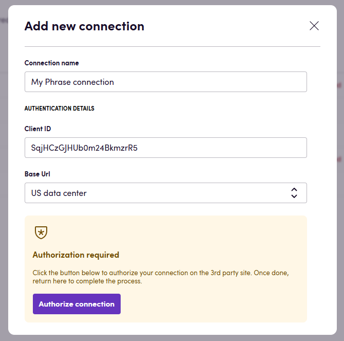
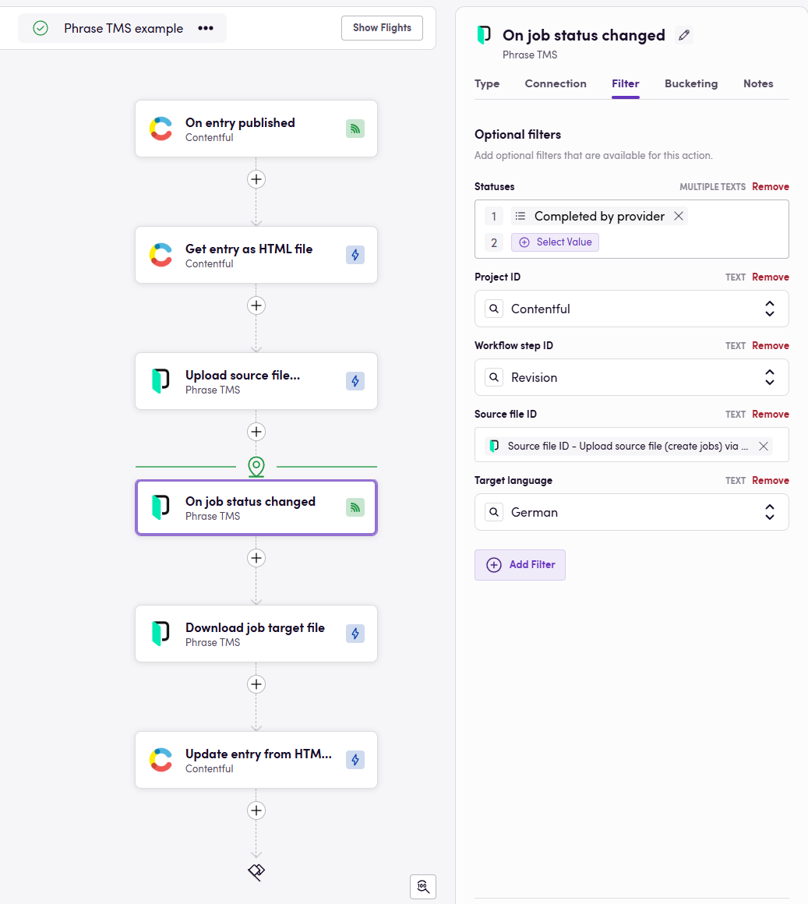

# Blackbird.io Phrase

Blackbird is the new automation backbone for the language technology industry. Blackbird provides enterprise-scale automation and orchestration with a simple no-code/low-code platform. Blackbird enables ambitious organizations to identify, vet and automate as many processes as possible. Not just localization workflows, but any business and IT process. This repository represents an application that is deployable on Blackbird and usable inside the workflow editor.

## Introduction

<!-- begin docs -->

Phrase TMS is a software as a service platform designed to automate and streamline translating and localizing digital products, such as web or mobile apps, websites, marketing content, etc. for international markets.

## Before setting up

Before you can connect you need to make sure that:

- You have a Phrase TMS account on the instance you want to connect to.
- You have permission to create and modify Registered OAuth apps.
- In Phrase go to Settings > Registered OAuth apps and click _New_.
- Fill in any name and description. For Redirect URI fill in: `https://bridge.blackbird.io/api/AuthorizationCode` and click _Save_.
- Copy the _Client ID_ of the newly created OAuth app.

## Connecting

1. Navigate to apps and search for Phrase.
2. Click _Add Connection_.
3. Name your connection for future reference e.g. 'My Phrase connection'.
4. Fill in the _Client ID_ that you copied from Phrase.
5. Select the data center your Phrase instance is hosted on. You can select between the US and EU data centers.
6. Click _Authorize connection_.
7. Follow the instructions that Phrase gives you, authorizing Blackbird.io to act on your behalf.
8. When you return to Blackbird, confirm that the connection has appeared and the status is _Connected_.

## Actions

### Analysis

- **Search job analyses** searches through all analyses that were created for a specific job
- **Search project analyses** searches through all analyses that were created for a specific project
- **Get analysis data** returns the full details of a specific analysis.
- **Create analyses** create one or multiple analyses for jobs in a given project
- **Download analysis file** download an analysis file in specified format, you can choose from CSV, JSON and LOG
- **Update analysis** Assign provider and net rate scheme to analysis

### Clients

- **Search clients** searches for clients on your instance matching certain criteria
- **Get client** get information about a single client
- **Create client** creates a new client in your Phrase instance
- **Update client** updates the information related to a specific client
- **Delete client** deletes a client

### Custom fields

Custom project field actions allow you to get and set the value of fields that you have created in Phrase.
Custom fields are associated with a specific type, e.g. date, number, text, etc. In Blackbird it's important to be 'type-safe', that's why every type has its own action pair.

- **Get project date custom field value**
- **Get project numeric custom field value**
- **Get project single select custom field value**
- **Get project multi select custom field value**
- **Get project text custom field value**
- **Get project URL custom field value**
- **Set project date custom field value**
- **Set project numeric custom field value**
- **Set project single select custom field value**
- **Set project text custom field value**
- **Set project URL custom field value**

> If a Custom field is not present in a project, it will be added as part of the `Set` action.

### Glossary

- **Create glossary** creates a new glossary in your Phrase instance that you can then fill manually or through the _Import glossary_ action.
- **Export glossary** returns the glossary as a Blackbird interchangable file (standard TBX) that can be imported into any other app.
- **Import glossary** takes a glossary from any other Blackbird app and imports it into a specific Phrase glossary.

### Job

- **Search jobs** returns a list of jobs in the project based on specified parameters
- **Get job** get all job information for a specific job
- **Create job** == DEPRECATED == will be removed in a future update. Use the action below.
- **Upload source file (create jobs)** uploads a source file to the project and creates relevant jobs for these files. This action will return multiple jobs as its output. It will also return a single Source file ID. See instructions below on how to use this in combination with 'On job status changed'. This action supports uploading XLIFF file as source v2.1 and v2.2 by converting them to v2.0.
- **Find job from source file ID** given a source file ID, a workflow step ID and a language, returns the job.
- **Find job from server task ID** given a server task ID, a workflow step ID and a project ID, returns the job.
- **Delete job** Deletes jobs from a project
- **Update job** Updates a job's global data
- **Pre-translate job** Pre-translates a job in the project
- **Export jobs to online repository** Exports jobs to online repository
- **Remove assigned providers from job** Removes all assigned providers from a job.
- **Get segments count** returns the number of segments in a job
- **Get aggregated segments count (multiple jobs)** Gets aggregated segment counts for specified jobs in a project

The following actions download job files in either their original format or as a bilingual file.
- **Download target file**
- **Download original file**
- **Download bilingual file**

The following actions update a job's file (source or target) from their original format or from a bilingual file.
- **Upload bilingual file**
- **Upload job source file**
- **Upload job target file**

### Project

- **Search projects** search for projects matching the filters of the input parameters
- **Find project** given the same parameters as _Search projects_, only returns the first matching project
- **Get project** get global project data for a specific project
- **Create project** Create a new project. It has the following special inputs:
- **Propagate Translations**: Propagate translations to lower workflows when the source updates
- **Create project from template** same as the previous action, however in this action you can use an existing project template
- **Add project target language** adds a target language to the project
- **Update project** updates a project with specified details
- **Delete project** delete the specified project
- **Download project original files** download all the original source files (in the jobs) of a project
- **Download project target files** download all the translated files (in the jobs) of a project
- **Assign providers from template** assigns providers to the project or specific jobs who were predefined on a certain template
- **Find project termbase** get the termbase linked to a project based on optional filters

### Project reference file

- **Search project reference files** searches through all project reference files
- **Create project reference files** add new project reference files. In case no file parts are sent, only 1 reference is created with the given note. Either at least one file must be sent or the note must be specified.
- **Download project reference file** download project reference file
- **Delete project reference file** delete a specific project reference file

### Quality assurance

- **Run auto LQA** runs Auto LQA for specified job parts or all jobs in a given workflow step
- **Download LQA assessment** downloads a single xlsx report based on specific job ID
- **Get LQA assessment** get a specific LQA assessment
- **Run quality assurance** Run quality checks on job part

### Conversation

- **Search conversations** searches through all conversations in a project
- **Get conversation** get information about a specific conversation
- **Delete conversation** deletes a plain conversation
- **Edit conversation** edits plain conversation
- **Create conversation** creates a new plain conversation
- **Add plain comment** adds a plain comment
- **Edit plain comment** edits the content of an existing plain comment
- **Delete plain comment** removes a plain comment

### Quote

- **Get quote** gets information about a quote
- **Create quote** creates a new quote from a project
- **Delete quote** deletes a quote

### Translation

- **Delete all translations** deletes all translations by project ID for the given jobs

### Translation memory

- **Search translation memories** Get all translation memories that match th specified search criteria
- **Create translation memory** create a new translation memory
- **Get translation memory** get information about a specific translation memory
- **Import TMX file** imports a new TMX file into the translation memory
- **Export translation memory** exports the selected translation memory as either a TMX or an XLSX
- **Insert segment into memory** insert a new segment into the translation memory
- **Delete translation memory** deletes the entire translation memory
- **Edit translation memories** edits the name and description of a translation memory
- **Update TM (insert segments from xliff)** updates the translation memory by inserting segments from an XLIFF file

### User

- **Search users** search through all users active on this Phrase instance
- **Find user** given the search parameters, returns the first matching user
- **Get user** get user information by ID
- **Add user** adds a new user
- **Update user** updates a specific user
- **Delete user** deletes a specific user

## Events

### Project

- **On project created**
- **On project deleted**
- **On project due date changed**
- **On project metadata updated**
- **On shared project assigned**
- **On project status changed**

### Job

- **On jobs created** Triggered when new jobs are created
- **On jobs deleted** Triggered when any jobs are deleted
- **On continuous jobs updated** Triggered when continuous jobs are updated
- **On jobs assigned** Triggered when any jobs are assigned
- **On jobs due date changed** Triggered when the due date of jobs are changed
- **On jobs exported** Triggered when any jobs are exported
- **On jobs source updated** Triggered when the source file of the jobs are updated
- **On job status changed** If you are using checkpoints, please fill all optional inputs (including Project ID). It will work even without a specified Project ID, but using it will allow us to check if the job already has the specified status. The status "Completed by linguist" will also trigger the event if the optional status "Completed" is set. In a checkpoint it works with either "Job ID" or "Source file ID" in combination with the workflow step or last workflow step. For more details see below.
- **On job target updated** Triggered when a job's target has been updated
- **On jobs unexported** Triggered when jobs are exported
- **On all jobs in workflow step reached status** Triggered when all jobs in a specific workflow step reach any of specified statuses. Returns only jobs in the specified workflow step. Please be aware that this event might trigger multiple times if several jobs are updated simultaneously, for example, through a bulk action or in very quick succession.

### User

- **On users created** Triggered when a new users have been created

### Analysis

- **On analysis created** Trigered when a new analysis has been created

### Quality assurance

- **On LQA reports created** Triggered when new reports can be downloaded within a specific project(Polling event)

## Examples 

### 1.4 Upload source file (create jobs) update
On April 25th we deployed an update that deprecated the "Create job" action in favor of the "Upload source file" action. The reason for this change was that "Create job" did not take into account the nuances of Phrase projects with workflow steps. The action "Upload source file" now always returns all the jobs that were created from the source file (multiple languages, multiple workflow steps if configured). It also returns the common denominator between these jobs namely the "Source file ID". Similar changes to the "Search jobs" action were made. This Source file ID should be used when pairing the creation of jobs with the "On job status changed" event. Example below:

In this Bird we opt to not create a new project for each workflow. After uploading the source file we can now configure the "On job status changed" checkpoint. Required fields are at least the Project ID and either the Job ID or the Source file ID. Since the "Upload source file" action in our case returns multiple jobs, we are going to rely on the Source file ID instead.

Besides the Source file ID we can specify that we are waiting for the 'Revision' Workflow step ID to be triggered. This narrows down our jobs even further. From this dropdown you should be able to select any workflow step that you have configured in Phrase. Alternatively, you can use the input "Last workflow step?" to always wait for the last workflow step. This is handy when different project templates have different workflow steps.

Finally we select the status "Completed by provider" to be the moment we want to download the job target file. We have narrowed down the job enough to point at the exact job we are looking for triggering the checkpoint on and continueing our Flight.

### Analysis with other systems

Our app allows you to export an analysis file (via the **Download analysis file** action) and use it in your workflow whenever you need it. You can also specify the format in which you want to download the file (such as JSON, CSV, or log), and then import it into the service of your choice.

Here's an example to demonstrate this feature between the Phrase and XTRF apps:

## Missing features

Not all API endpoints are covered, let us know if you are missing features or if you see other improvements!

## Feedback

Feedback to our implementation of Phrase is always very welcome. Reach out to us using the [established channels](https://www.blackbird.io/) or create an issue.

<!-- end docs -->
