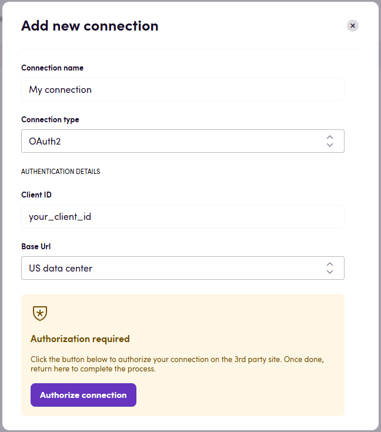
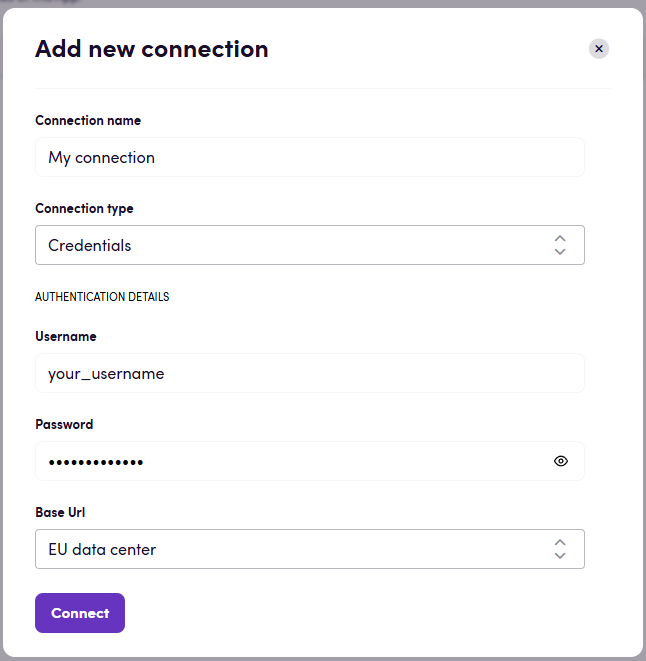
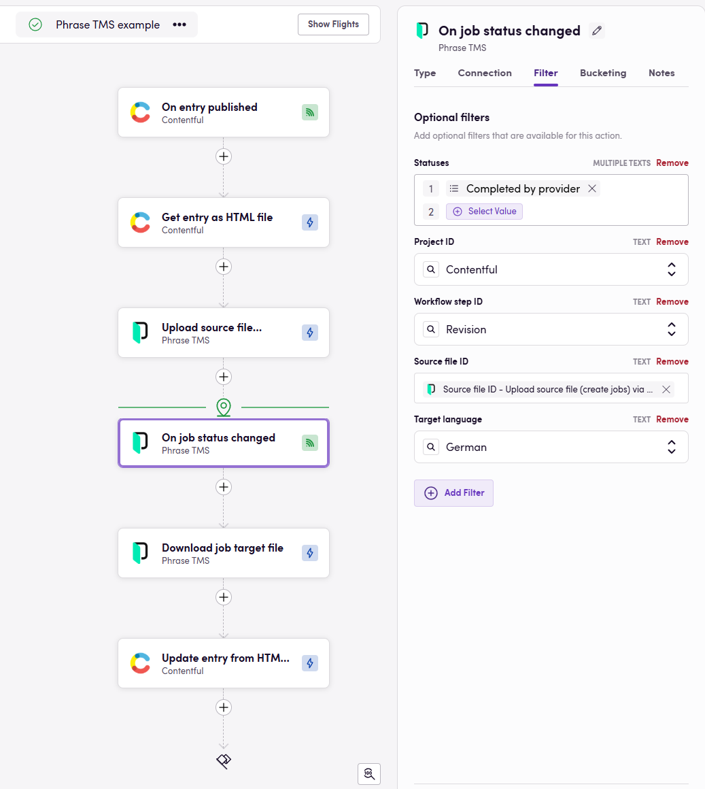
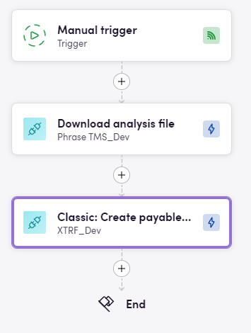
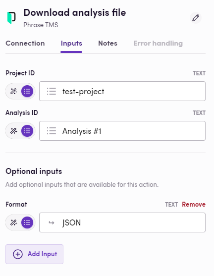
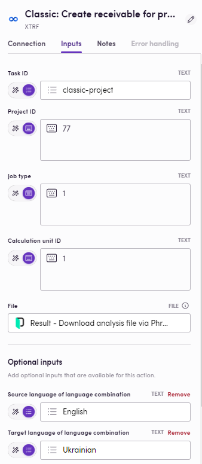

# Blackbird.io Phrase

Blackbird is the new automation backbone for the language technology industry. Blackbird provides enterprise-scale automation and orchestration with a simple no-code/low-code platform. Blackbird enables ambitious organizations to identify, vet and automate as many processes as possible. Not just localization workflows, but any business and IT process. This repository represents an application that is deployable on Blackbird and usable inside the workflow editor.

## Introduction

<!-- begin docs -->

Phrase TMS is a software as a service platform designed to automate and streamline translating and localizing digital products, such as web or mobile apps, websites, marketing content, etc. for international markets.

## Before setting up

Before you can connect you need to make sure that:

- You have a Phrase TMS account on the instance you want to connect to.

In order to connect using the _OAuth2_ connection type, ensure that:

- You have permission to create and modify Registered OAuth apps.
- In Phrase go to Settings > Registered OAuth apps and click _New_.
- Fill in any name and description. For Redirect URI fill in: `https://bridge.blackbird.io/api/AuthorizationCode` and click _Save_.
- Copy the _Client ID_ of the newly created OAuth app.

## Connecting

Navigate to apps and search for Phrase. Click _Add Connection_ and name your connection for future reference e.g. 'My Phrase connection'.

### OAuth2

1. Select the _OAuth2_ connection type from the dropdown.
2. Fill in the _Client ID_ that you copied from Phrase.
3. Select the data center your Phrase instance is hosted on. You can select between the US and EU data centers.
4. Click _Authorize connection_.
5. Follow the instructions that Phrase gives you, authorizing Blackbird.io to act on your behalf.
6. When you return to Blackbird, confirm that the connection has appeared and the status is _Connected_.

### Credentials

1. Select the _Credentials_ connection type from the dropdown.
2. Fill in the _username_ and _password_ of your Phrase account.
3. Select the data center your Phrase instance is hosted on. You can select between the US and EU data centers.
4. Click _Connect_.
5. Wait for the process to complete, confirm that the connection has appeared and the status is _Connected_.

## Actions

### Analysis

- **Search job analyses** Search analyses for a specific job.
- **Find analysis** Find a single project analysis using optional filters.
- **Search project analyses** Search analyses for a specific project.
- **Get analysis data** Get full details for a specific analysis.
- **Create analyses** Create one or more analyses for jobs in a project.
- **Download analysis file** Download an analysis file.
- **Update analysis** Update provider and net rate scheme for an analysis.
- **Delete analyses** Delete one or more analyses.

### Clients

- **Search clients** Search clients on your instance.
- **Get client** Get details for a specific client.
- **Create client** Create a new client.
- **Update client** Update a specific client.
- **Delete client** Delete a specific client.

### Conversations

- **Get conversation** Get a plain conversation.
- **Search conversations** Search conversations.
- **Delete conversation** Delete a plain conversation.
- **Edit conversation** Edit a plain conversation.
- **Create conversation** Create a plain conversation.
- **Create LQA conversation** Create an LQA conversation.
- **Add plain comment** Add a plain comment.
- **Edit plain comment** Edit a plain comment.
- **Delete plain comment** Delete a plain comment.

### Custom fields

Custom project field actions allow you to get and set the value of fields that you have created in Phrase.
Custom fields are associated with a specific type, for example date, number, or text. Each type has its own action.

- **Get project text custom field value**
- **Get project numeric custom field value**
- **Get project project date custom field value**
- **Get project single select custom field value**
- **Get project multi select custom field value**
- **Get project URL custom field value**
- **Set project text custom field value**
- **Set project numeric custom field value**
- **Set project URL custom field value**
- **Set project date custom field value**
- **Set project single select custom field value**

> If a Custom field is not present in a project, it will be added as part of the `Set` action.

### Glossaries

- **Create glossary** Create a new glossary.
- **Export glossary** Export a glossary.
- **Import glossary** Import a glossary.
- **Remove all terms from glossary** Delete all terms in a glossary.

### Jobs

- **Search jobs** Search jobs in a project using specified filters.
- **Export jobs to online repository** Export jobs to an online repository.
- **Get job** Get all information for a specific job.
- **Find job from source file ID** Find a job using a source file ID, workflow step ID, and language.
- **Find job from server task ID** Find a job using a server task ID, workflow step ID, and project ID.
- **Upload source file (create jobs)** Upload a new source file and create jobs for the configured target languages and workflow steps.
- **Delete jobs** Delete jobs from a project.
- **Update job** Update a job's global data.
- **Download job target file** Download the target file of a job.
- **Download job original file** Download the original file of a job.
- **Upload job target file** Upload and update the target file of a job.
- **Download job bilingual file** Download the bilingual file of a job.
- **Upload job bilingual file** Upload a bilingual file to update a job.
- **Pre-translate job** Pre-translate a job in a project.
- **Upload job source file** Upload and update the source file of a job in a project.
- **Get segments count** Get segment counts for a specific job.
- **Get aggregated segments count (multiple jobs)** Get aggregated segment counts for specific jobs in a project.
  Advanced settings:
  - **LQA Score null?**: Filter jobs by whether the LQA score is null.
  - **Last workflow step**: Filter jobs to the last workflow step.
- **Remove assigned providers from job** Remove assigned providers from a job.
- **Split job** Split a job into multiple parts.

### Miscellaneous

- **Delete all project translations** Delete all translations for selected jobs in a project.
- **Debug** Run a debug action.

### Projects

- **Search projects** Search projects using the provided filters.
- **Find project** Find the first project matching the same filters as Search projects.
- **Get project** Get global data for a specific project.
- **Create project** Create a new project.
  Advanced settings:
  - **Propagate Translations**: Propagate translations to lower workflows when the source updates.
- **Create project from template** Create a new project from a template.
- **Search term bases** Search term bases using the provided filters.
- **Add project target language** Add a target language to a project.
- **Update project** Update project details.
- **Delete project** Delete a specific project.
- **Download project original files** Download project source files.
- **Download project target files** Download project target files.
  Advanced settings:
  - **Source file ID**: Download files only for a specific source file.
- **Assign project providers from template** Assign providers to a project or specific jobs from a template.
- **Find project termbase** Get the term base linked to a project based on optional filters.
- **Set project translation memories** Set translation memories for a project.
- **Set project term bases** Set term bases for a project, optionally per target language.
- **Get project providers** Get providers assigned to a project.

### Project templates

- **Search project templates** Search project templates using filters.
- **Create project template** Create a project template from an existing project.
- **Set project template translation memory** Assign a translation memory to a project template for all target languages and workflow steps.
- **Set project template term bases** Assign a term base to a project template for a specific target language and workflow step.

### Quality assurance

- **Download LQA assessment** Download a single LQA report for a specific job ID.
- **Get LQA assessment** Get a specific LQA assessment.
- **Start LQA assessment** Start LQA assessment for a specific job part.
- **Finish LQA assessment** Finish LQA assessment for a specific job part.
- **Run auto LQA** Run auto LQA for specific job parts or all jobs in a workflow step.
- **Run quality assurance** Run quality checks on a job part.
  Advanced settings:
  - **Maximum warning count**: Limit the number of warnings returned, from 1 to 100.

### Quotes

- **Get quote** Get a quote by ID.
- **Search quotes** Search quotes in a project using optional name and status filters.
- **Find quote** Find a single quote in a project using filters.
- **Create quote** Create a new project quote.
- **Delete quote** Delete a specific quote.

### Reference files

- **Search project reference files** Search project reference files.
- **Add project reference files** Add project reference files.
- **Download project reference file** Download a project reference file.
- **Delete project reference file** Delete a specific project reference file.

### Translation memory

- **Search TM** Get translation memories that match search criteria.
- **Create TM** Create a new translation memory.
- **Get TM** Get a specific translation memory.
- **Import TMX file into TM** Import a TMX file into a translation memory.
- **Export TM** Export a translation memory.
- **Update TM from XLIFF** Update a translation memory by inserting segments from an XLIFF file.
- **Insert text into TM** Insert a segment into a translation memory.
- **Delete TM** Delete a selected translation memory.
- **Edit TMs** Edit translation memories.

### Users

- **Search users** Search users using optional filters.
- **Find user** Find the first user matching the search filters.
- **Get user** Get user information by ID.
- **Add user** Add a new user.
- **Update user** Update a specific user.
- **Delete user** Delete a specific user.

## Events

### Miscellaneous

- **On project created** Triggered when a project is created.
- **On project deleted** Triggered when a project is deleted.
- **On project due date changed** Triggered when a project due date changes.
- **On project metadata updated** Triggered when project metadata is updated.
- **On shared project assigned** Triggered when a shared project is assigned.
- **On project status changed** Triggered when a project status changes.
- **On jobs created** Triggered when new jobs are created.
- **On jobs deleted** Triggered when jobs are deleted.
- **On continuous jobs updated** Triggered when continuous jobs are updated.
- **On jobs assigned** Triggered when jobs are assigned.
- **On jobs due date changed** Triggered when job due dates change.
- **On jobs exported** Triggered when jobs are exported.
- **On jobs source updated** Triggered when job source files are updated.
- **On job status changed** Triggered when a job status changes. For reliable checkpoint behavior, set optional filters such as Project ID, and use either Job ID or Source file ID with workflow step filters.
  Advanced settings:
  - **Project name contains**: Trigger only when the project name contains a specific text.
  - **Project name doesn't contains**: Exclude projects where the name contains a specific text.
  - **Project note contains**: Trigger only when the project note contains a specific text.
  - **Project note doesn't contain**: Exclude projects where the project note contains a specific text.
- **On all jobs in workflow step reached status** Triggered when all jobs in a specific workflow step reach any specified statuses and outputs only jobs in that workflow step. Either Workflow level or workflow step needs to be provided.
  Advanced settings:
  - **Target language**: Restrict the trigger to a specific target language.
- **On job target updated** Triggered when a job target is updated.
- **On jobs unexported** Triggered when jobs are unexported.
- **On analysis created** Triggered when a new analysis is created.

### Users

- **On users created** Triggered when new users are added.

### Quality assurance

- **On LQA reports created** Triggered when new LQA reports are available in a specific project.

## Examples 

### 1.4 Upload source file (create jobs) update
On April 25th we deployed an update that deprecated the "Create job" action in favor of the "Upload source file" action. The reason for this change was that "Create job" did not take into account the nuances of Phrase projects with workflow steps. The action "Upload source file" now always returns all the jobs that were created from the source file (multiple languages, multiple workflow steps if configured). It also returns the common denominator between these jobs namely the "Source file ID". Similar changes to the "Search jobs" action were made. This Source file ID should be used when pairing the creation of jobs with the "On job status changed" event. Example below:

In this Bird we opt to not create a new project for each workflow. After uploading the source file we can now configure the "On job status changed" checkpoint. Required fields are at least the Project ID and either the Job ID or the Source file ID. Since the "Upload source file" action in our case returns multiple jobs, we are going to rely on the Source file ID instead.

Besides the Source file ID we can specify that we are waiting for the 'Revision' Workflow step ID to be triggered. This narrows down our jobs even further. From this dropdown you should be able to select any workflow step that you have configured in Phrase. Alternatively, you can use the input "Last workflow step?" to always wait for the last workflow step. This is handy when different project templates have different workflow steps.

Finally we select the status "Completed by provider" to be the moment we want to download the job target file. We have narrowed down the job enough to point at the exact job we are looking for triggering the checkpoint on and continueing our Flight.

### Analysis with other systems

Our app allows you to export an analysis file (via the **Download analysis file** action) and use it in your workflow whenever you need it. You can also specify the format in which you want to download the file (such as JSON, CSV, or log), and then import it into the service of your choice.

Here's an example to demonstrate this feature between the Phrase and XTRF apps:

## Missing features

Not all API endpoints are covered, let us know if you are missing features or if you see other improvements!

## Feedback

Feedback to our implementation of Phrase is always very welcome. Reach out to us using the [established channels](https://www.blackbird.io/) or create an issue.

<!-- end docs -->
