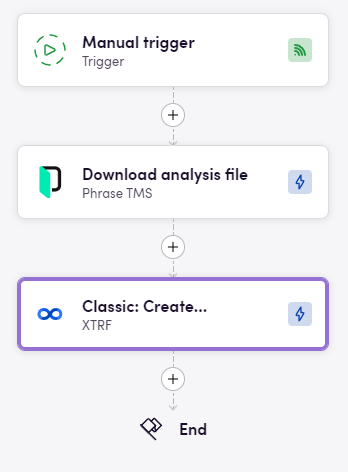

# Blackbird.io Phrase

Blackbird is the new automation backbone for the language technology industry. Blackbird provides enterprise-scale automation and orchestration with a simple no-code/low-code platform. Blackbird enables ambitious organizations to identify, vet and automate as many processes as possible. Not just localization workflows, but any business and IT process. This repository represents an application that is deployable on Blackbird and usable inside the workflow editor.

## Introduction

<!-- begin docs -->

Phrase (previously Memsource) is a software as a service platform designed to automate and streamline translating and localizing digital products, such as web or mobile apps, websites, marketing content, etc. for international markets.

## Before setting up

Before you can connect you need to make sure that:

- You have a Phrase account on the instance you want to connect to.
- You have permission to create and modify Registered OAuth apps.
- In Phrase go to Settings > Registered OAuth apps and click _New_.
- Fill in any name and description. For Redirect URI fill in: `https://bridge.blackbird.io/api/AuthorizationCode` and click _Save_.
- Copy the _Client ID_ of the newly created OAuth app.

## Connecting

1. Navigate to apps and search for Phrase. If you cannot find Phrase then click _Add App_ in the top right corner, select Phrase and add the app to your Blackbird environment.
2. Click _Add Connection_.
3. Name your connection for future reference e.g. 'My Phrase connection'.
4. Fill in the _Client ID_ that you copied from Phrase.
5. Fill in the Base URL to the Phrase instance you want to connect to (this can be f.e. eu or us). Example: `https://us.cloud.memsource.com`
6. Click _Authorize connection_.
7. Follow the instructions that Phrase gives you, authorizing Blackbird.io to act on your behalf.
8. When you return to Blackbird, confirm that the connection has appeared and the status is _Connected_.

## Actions

### Analysis

- **List analyses**
- **Get analysis**
- **Create analysis**
- **Download analysis file**

### Clients

- **List clients**
- **Get client**
- **Add client**
- **Update client**
- **Delete client**

### Connector

- **List connector**
- **Get connector**

### File

- **List all files**
- **Get file**
- **Upload file**

### Glossary

- **Create new glossary**
- **Export glossary**
- **Import glossary**

### Job

- **List all jobs**
- **Get job**
- **Create job**
- **Delete job**
- **Get segments**
- **Edit job**
- **Download target file**

### Pricelist

- **List price lists**

### Project

- **List projects**
- **List project templates**
- **Get project**
- **Create project**
- **Create project from template**
- **Add target language**
- **Edit project**
- **Delete project**

### Project reference file

- **List reference files**
- **Create reference file**
- **Download reference file**
- **Delete reference file**

### Quality assurance

- **Add ignored warning**
- **List LQA profiles**
- **Delete LQA profile**

### Quote

- **Get quote**
- **Create quote**
- **Delete quote**

### Translation

- **List translation settings**
- **Translate with MT**
- **Translate with MT by project**

### Translation memory

- **List translation memories**
- **Create translation memory**
- **Get translation memory**
- **Import TMX file**
- **Export translation memory**
- **Insert segment into memory**
- **Delete translation memory**

### User

- **List users**
- **Get user**
- **Add user**
- **Update user**
- **Delete user**

### Vendor

- **Add vendor**
- **List vendors**
- **Get vendor**

## Events

### Project

- **On project created**
- **On project deleted**
- **On project due date changed**
- **On project metadata updated**
- **On shared project assigned**
- **On project status changed**

### Job

- **On job created**
- **On job deleted**
- **On continuous job updated**
- **On job assigned**
- **On job due date changed**
- **On job exported**
- **On job source updated**
- **On job status changed**
- **On job target updated**
- **On job unexported**

### Template

- **On template created**
- **On template deleted**
- **On template updated**

### Analysis

- **On analysis created**

## Example

This example shows one of many use cases. Here, whenever an article is published we fetch the missing translations and retrieve the article as an HTML file. Then we create a new Phrase project with the missing locales as the target languages and upload the article as jobs. We link the project with the article to automatically push the new translations back when they are done in a second bird.

## Analysis with others systems

Our app allows you to export analysis file (via **Download analysus file** action) and then use it in your bird whenewher you want. You also can specify format in which you want to download it (it can be: json, csv or log), then you can import this file in service you want to.

This just a bird for demonstration this feature between Phrase and XTRF apps:

## Missing features

Not all API endpoints are covered, let us know if you are missing features or if you see other improvements!

## Feedback

Feedback to our implementation of Phrase is always very welcome. Reach out to us using the [established channels](https://www.blackbird.io/) or create an issue.

<!-- end docs -->
